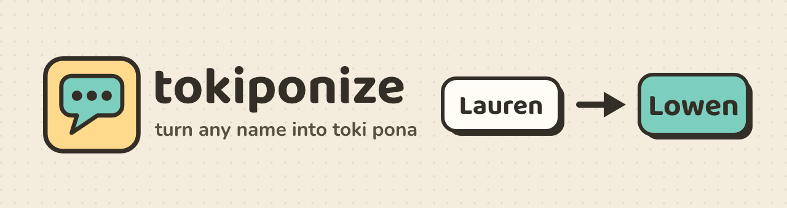
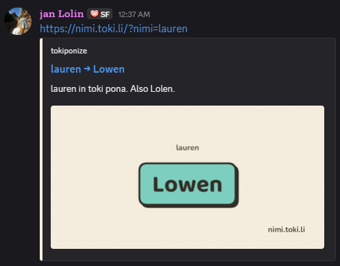

<p align="center">
  
</p>

<p align="center">
  <a href="https://nimi.toki.li">nimi.toki.li</a> |
  <a href="https://www.npmjs.com/package/tokiponize">npm</a> |
  <a href="#free-api">free API</a>
</p>

Convert foreign names into phonotactically valid **toki pona**, with scored
alternatives. Usable as a library, from the command line, or over HTTP!

```ts
import { tokiponize, tokiponizeBest, isValidName, syllabify } from "tokiponize";

tokiponizeBest("Lauren"); // "Lowen"
tokiponizeBest("Sam");    // "San"

tokiponize("Titan");
// [ { name: "Sitan", score: -0.25 }, { name: "Tetan", score: -0.75 }, ... ]

isValidName("Koti");    // false, *ti is forbidden
syllabify("sitelen");   // ["si", "te", "len"]
```

## Install

```sh
npm install -g tokiponize   # CLI
npm install tokiponize      # library
```

## CLI

```sh
tokiponize Lauren
# Lauren:
#   Lowen (0)
#   ...

tokiponize --best Titan Chris María
# Titan -> Sitan
# Chris -> Kisi
# María -> Mawija

tokiponize --json Sam
# {"name":"Sam","candidates":[{"name":"San","score":-0.4}, ...]}

tokiponize --check Koti
# Koti: not valid toki pona
```

Run `tokiponize --help` for the full flag list (`--limit`, `--best`, `--json`,
`--check`, `--experimental`).

## Free API

No key or signup required! This is a free HTTP API that returns the same candidates
the library returns:

```sh
curl "https://nimi.toki.li/api/tokiponize?name=Jakarta"
```

```json
{
  "name": "Jakarta",
  "best": "Jakata",
  "candidates": [
    { "name": "Jakata", "score": -1.2 },
    { "name": "Jakawa", "score": -1.75 },
    { "name": "Jakala", "score": -2.05 }
  ]
}
```

| parameter | what it does |
|-----------|--------------|
| `name` | the name to convert, spaces and all (required) |
| `limit` | how many candidates, 1 to 8 (default 4) |
| `experimental` | `1` to mix in the learned suggestions |

## Corrections

Under every result is a box for the reading you would have used instead.
Further down, a queue shows a name someone else flagged and asks how you
would write it before showing you their answer.

**Nothing about who filed a reading is stored.**

We use this data to train our experimental model, which helps us predict which readings are likely to be correct. The predictions are also used to improve the base model's rule tunings. I greatly appreciate your contributions to this project!

## Sharing a result

Every result has its own link, and pasting one into Discord (or anywhere
else that reads OpenGraph tags) draws the name as a card:

<p align="center">
  
</p>

## How it works

Names are tokiponized in two steps:

1. Spelling is read into a phoneme (place, manner, voicing) per
   the [Tokiponization page](https://sona.pona.la/wiki/Tokiponization).
2. Phonemes get fit into toki pona's syllable scheme
   per the [Phonotactics page](https://sona.pona.la/wiki/Phonotactics):
   (C)V(n) syllables, forbidden `*wu`/`*wo`/`*ji`/`*ti`, no adjacent nasals. When a
   name doesn't fit well, or has multiple possible alternatives (echo vowels, dropped sounds,
   glides), they get scored and ranked instead of picking one answer for you.

Input isn't limited to plain English spelling, either! Accented Latin (`ñ`, `ç`,
`ø`, `ł`, ...), Cyrillic, Greek, Hangul, Japanese kana, and Devanagari are all
supported!

## Experimental mode

`--experimental` (or `tokiponize(name, { experimental: true })`) adds
suggestions from a small model trained on tokiponizations the community
actually uses.

**This is not an LLM or generative AI.** The "model" is a ~3KB table of
letter-rewrite frequencies counted from real community examples, closer to
a spell-checker's statistics than to a chatbot. There's no neural network,
nothing runs remotely, and it can only ever output toki pona syllables.

## Accuracy

Tested against ~4,900 real tokiponizations, taken from the
[toki pona labels on Wikidata](https://www.wikidata.org/), which are kept in
[`eval/data/wikidata-tok.jsonl`](eval/data/wikidata-tok.jsonl).

| engine | top-1 | top-4 | top-8 | missed entirely |
|--------|-------|-------|-------|-----------------|
| rules (default) | 44.6% | 57.8% | 59.5% | 40.5% |
| `--experimental` | 44.6% | 59.0% | 62.0% | 38.0% |

Most misses are names the community based on what a place calls itself
(Japan -> `Nijon` comes from "Nihon"), which the written source doesn't
show. Starting from the name the community used shows that the engine does much better. The
scripts behind these numbers live in [`eval/`](eval/).

## Limitations

Some letters and syllables are unfortunately ambiguous without knowing the source language.
A big one is `r`: Latin spelling defaults to the English (`w`), while Cyrillic, Greek, Hangul, and kana default to a
tap/trill (`l`), since those scripts are unambiguous about this case. A French or
German uvular `r` (which would ideally be `k`) reads as `w` too, since
there's no way to tell it apart from English by spelling alone. That's why
`tokiponize` returns several ranked candidates instead of just one.

If you find that this tool is not working as expected, please [open an issue](https://github.com/laurhinch/tokiponize/issues/new) or [submit a pull request](https://github.com/laurhinch/tokiponize/pulls).

## Development

```sh
npm install
npm test                 # compile and run the test suite
npm run build            # compile src/ to dist/ (what gets published)
npm run dev -- Lauren    # build and run the CLI in one step
npm run site             # the site on localhost:8787, API routes included
```

`npm run site` serves `site/` with `/api/tokiponize` and `/api/suggest`
attached, so the correction box works without a Cloudflare account.
Corrections go into a local SQLite file and `/dev/suggestions` shows what
has been filed. `/lib` is read straight out of `dist/`, so editing
`site/index.html` only needs a reload, while library changes need a
rebuild. Needs Node 22.5 or newer for `node:sqlite`.

## License

MIT
